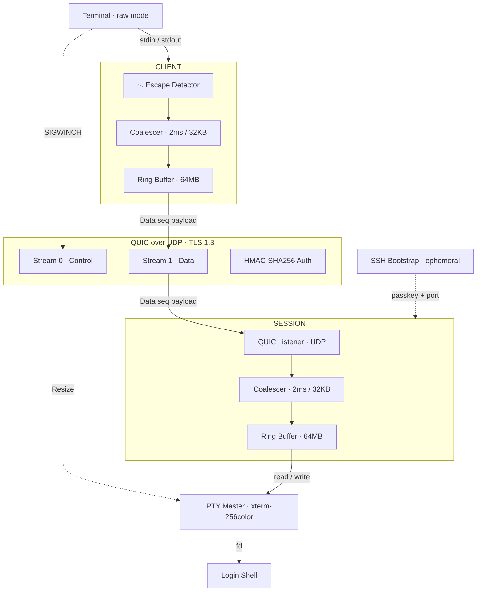

# Architecture

## System Overview

## Connection Lifecycle

How a goet connection is established, maintained, and torn down.

**Prerequisite:** The remote host must have `goet` installed and in PATH.
goet cannot connect to a server that only has SSH — it uses SSH purely as a
bootstrap mechanism to launch the remote `goet session` process, then all
terminal I/O flows over QUIC/UDP.

```mermaid
sequenceDiagram
    participant T as Terminal
    participant C as Client
    participant SSH as SSH
    participant S as Session
    participant PTY as PTY + Shell

    %% ── Phase 1: SSH Bootstrap ──────────────────
    rect rgba(245, 158, 11, 0.08)
    note over C,S: Phase 1 · SSH Bootstrap
    C->>SSH: ssh user@host goet session -f ssh -p 0
    C->>SSH: passkey (hex, via stdin)
    SSH->>S: exec goet session
    SSH->>S: passkey (stdin)
    S->>S: Start QUIC listener<br/>(random UDP port)
    S-->>SSH: port number (stdout)
    SSH-->>C: port number
    note over SSH: SSH process killed —<br/>no longer needed
    end

    %% ── Phase 2: QUIC + Auth ────────────────────
    rect rgba(6, 182, 212, 0.08)
    note over C,S: Phase 2 · QUIC Connect + Auth
    C->>S: QUIC handshake (TLS 1.3,<br/>self-signed ephemeral cert)
    C->>S: Open control stream (stream 0)
    C->>S: Open data stream (stream 1)
    note over C,S: Both derive auth material from<br/>TLS exporter + passkey
    C->>S: AuthRequest { HMAC-SHA256 token }
    S->>S: Verify HMAC
    S-->>C: AuthResponse { OK }
    end

    %% ── Phase 3: Handshake ──────────────────────
    rect rgba(59, 130, 246, 0.08)
    note over C,S: Phase 3 · Handshake + PTY Spawn
    C->>S: SequenceHeader { last_recv_seq: 0 }<br/>(on data stream)
    S-->>C: SequenceHeader { last_recv_seq: 0 }<br/>(on control stream)
    C->>S: TerminalInfo { term: $TERM }<br/>(on control stream)
    S->>PTY: Spawn login shell<br/>with client's TERM
    S->>S: Bounce PTY size (rows−1)<br/>to force SIGWINCH
    note over T,C: Client enters raw mode
    T->>C: SIGWINCH (terminal size)
    C->>S: Resize { rows, cols }
    S->>PTY: pty.Setsize()
    end

    %% ── Phase 4: Steady State ───────────────────
    rect rgba(34, 197, 94, 0.08)
    note over T,PTY: Phase 4 · Steady-State I/O
    loop Terminal I/O
        T->>C: stdin bytes
        note over C: Coalesce (2ms / 32KB)
        C->>S: Data { seq, payload }
        S->>PTY: Write to PTY
        PTY-->>S: PTY output
        note over S: Coalesce (2ms / 32KB)
        S-->>C: Data { seq, payload }
        C-->>T: stdout bytes
    end
    loop Every 5 seconds
        S-->>C: Heartbeat { timestamp_ms }
        C-->>S: Heartbeat { timestamp_ms }
    end
    note over C,S: Both sides store sent Data<br/>in 64MB ring buffer for catchup
    end

    %% ── Phase 5: Reconnect ──────────────────────
    rect rgba(245, 158, 11, 0.08)
    note over C,S: Phase 5 · Reconnect (network drop)
    note over C: Connection lost —<br/>retry with 1s delay
    C->>S: New QUIC handshake + Auth<br/>(same passkey)
    note over S: Close old connection,<br/>flush coalesced data
    C->>S: SequenceHeader { last_recv_seq: N }
    S-->>C: SequenceHeader { last_recv_seq: M }
    C->>S: TerminalInfo { term: $TERM }
    note over C: Resend Data seq M+1..latest<br/>from client catchup buffer
    note over S: Replay Data seq N+1..latest<br/>from session catchup buffer
    S->>S: Bounce PTY size
    T->>C: SIGWINCH
    C->>S: Resize { rows, cols }
    note over C,S: Resume steady-state I/O
    end

    %% ── Phase 6: Shutdown ───────────────────────
    rect rgba(239, 68, 68, 0.08)
    note over T,PTY: Phase 6 · Shutdown
    alt Shell exits (exit, ctrl-d)
        PTY-->>S: EOF
        S-->>C: Shutdown {}
        S->>S: Close PTY, wait shell
    else Client escape (~.)
        T->>C: ~.
        C->>S: Shutdown {}
        note over C: Exit cleanly
    else Context cancelled (SIGTERM)
        S-->>C: Shutdown {}
        S->>PTY: Close PTY master → SIGHUP
        note over S: Wait 2s grace, then SIGKILL
    end
    end
```

## Notes

- **SSH is ephemeral**: killed after port exchange. All terminal data flows over QUIC/UDP.
- **Deferred PTY spawn**: the session doesn't create a shell until the first client connects with `TerminalInfo`, so the remote shell gets the client's actual `$TERM`.
- **PTY size bounce**: on (re)connect, the session shrinks the PTY by 1 row. The client immediately sends its real size, guaranteeing a `SIGWINCH` so TUI apps redraw.
- **Catchup is symmetric**: both client and session maintain 64MB ring buffers. On reconnect, each side tells the other what it last received, and the sender replays from that point.
- **Write coalescing**: small writes are batched (2ms deadline or 32KB threshold) into fewer `Data` messages, reducing per-packet overhead on the QUIC stream.
